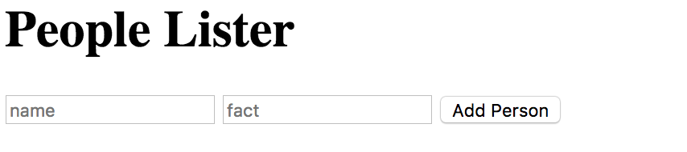
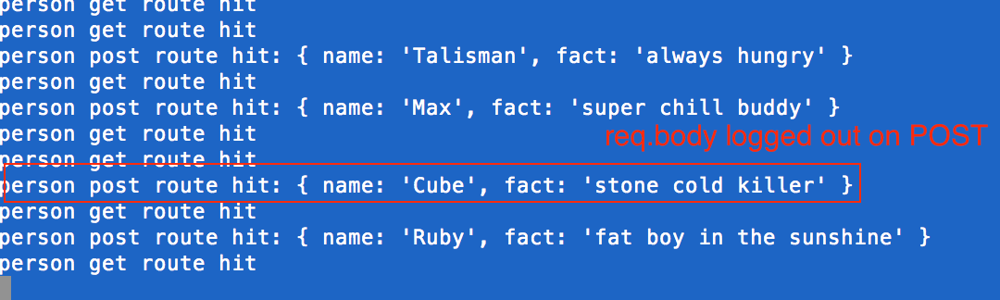
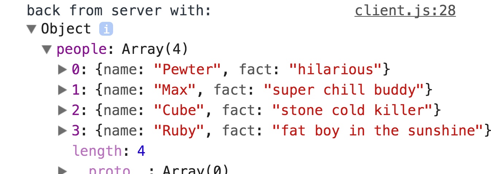
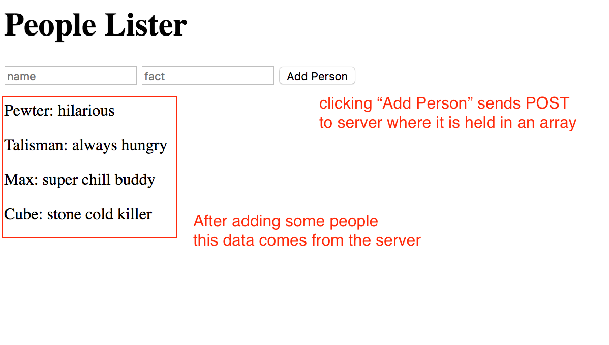
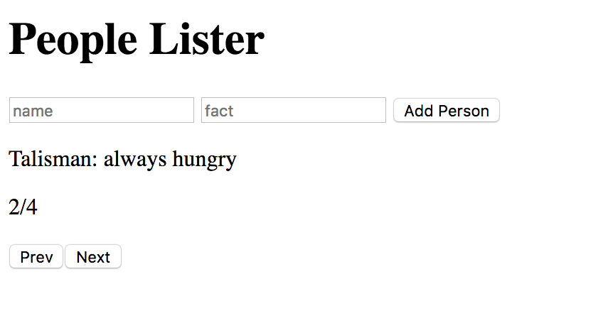

Weekend Challenge 2
===

Welcome to your second weekend challenge! We'll be focusing on Node/Express this weekend while reinforcing the JavaScript and JQuery lessons from the previous weeks.

Base Mode:
---

First, get a basic Node/Express project set up that is serving your HTML file with JQuery and a 'client.js' script file sourced.

Setup an express route "/person" that has both a ```GET``` and a ```POST```. 

For this project you'll be creating an app that takes in user input as follows:



When the "Add Person" button is clicked the user input should be put into an object and sent to the "/person" route via ```POST```. 

Once on the server, log out the object (req.body):



Then push this new person into an array. the ```GET``` of the "/person" route should return an object that has an array within that has all the people who have been added. 



This GET call should be called on page load and on "Add Person" click. Once the data is received display each person on the DOM.



Hard Mode:
---

Create a carousel that shows only one person at a time. There should be "next" and "previous" buttons that wrap (if at first person, hitting previous shoud go to the last) and an indicator of which person is being shown:



Pro Mode:
---
Add a "remove" button for each person that removes that person from the array on the server. 


